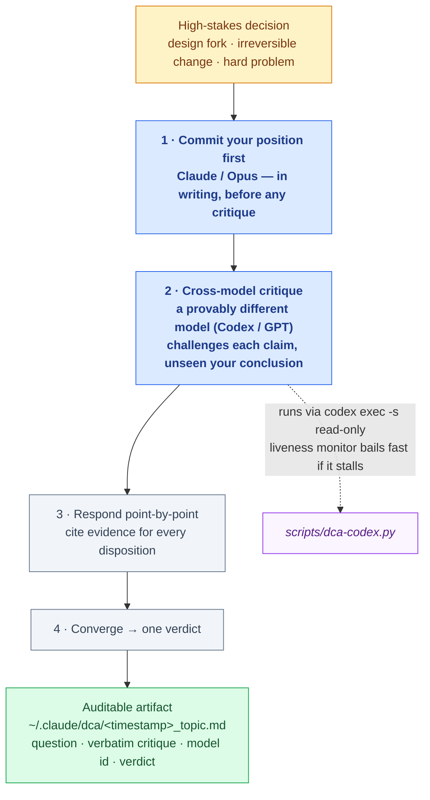

# codebate — a cross-model decision gate for Claude Code

> Put a high-stakes decision through a debate before you commit — with a
> genuinely different model on the other side. *(code + debate)*

When you ask a model to review its own reasoning, it rubber-stamps. It shares its
own blind spots, so "looks good to me" is nearly free. **codebate** fixes that by
forcing a structured, auditable process around your riskiest decisions:

1. **Commit your position first**, in writing, before any critique.
2. **Get a genuine cross-model critique** — a *different* model (Codex / GPT via
   the `codex` CLI) challenges each claim, having never seen your conclusion.
3. **Respond point-by-point**, citing evidence for every disposition.
4. **Converge** into one verdict, captured in an auditable artifact file.

You invoke codebate on the **stakes** of a decision — a design fork, an
irreversible change, a hard problem — not on which file you touched. An optional
companion hook can turn that into a hard gate: with enforcement on, edits to
process-critical files (`CLAUDE.md`, `settings.json`, hooks, skills) are blocked
until the debate is done. It's off by default (see [The hook](#the-hook-judgment-first-enforcement-optional)).

## At a glance



The two blue steps are the guarantees that make it more than a chat with another
model: you **commit before you hear the critique** (no rubber-stamping), and the
critic is a **provably different** model (no shared blind spots).

## Why "cross-model" is the whole point

This project exists because of a bug worth telling. An earlier version routed the
"cross-model" critique through a convenient agent wrapper — and a provenance probe
found that wrapper was quietly returning the **same** model doing the driving. A
critic that shares your model shares your blind spots: the "second opinion" was an
echo. The fix was to shell out **directly** to `codex exec`, whose model is
provider-verifiable.

The lesson generalizes: the value of a critique leg is not how *capable* it is —
it's how *independent* it is. codebate is built around protecting that independence
(commit-first, self-contained evidence, verbatim critique) rather than maximizing
the critic's power.

## "Isn't there already a Codex plugin?" — access vs. process

Yes — [`openai/codex-plugin-cc`](https://github.com/openai/codex-plugin-cc) is
excellent, and codebate does **not** replace it. They solve different problems:

| | Codex plugin (`codex-plugin-cc`) | codebate |
|---|---|---|
| **What it gives you** | *Access* — Codex as a tool/agent inside Claude Code: delegate a task, get a second implementation, run a command. | *Process* — a disciplined decision procedure that happens to use a second model as one step. |
| **You reach for it when** | you want another model to **do work**. | you want to **de-risk a decision** you're about to commit to. |
| **Core primitive** | a capability (call Codex). | a protocol (commit-first → independent critique → converge → artifact). |
| **What you're left with** | Codex's output. | an auditable record of *why* the call went the way it did. |

The distinction is **access vs. process**. A raw Codex call is a second opinion
*on tap*; codebate is the second-opinion *ceremony* — it decides **when** a decision
is high-stakes enough to warrant one, forces you to **commit your position before**
you hear the critique (so you can't rubber-stamp), guarantees the critic is a
**provably different** model (the hollow-provenance bug above), and leaves an
**artifact** so the reasoning survives the session.

**Why not just build this on top of the Codex plugin?** Because a plugin wrapper is
exactly what hid the model's identity in the bug that motivated this project — the
"cross-model" leg was silently the same model. codebate shells out to `codex exec`
**directly** precisely so the critic's provenance is verifiable, not delegated. The
plugin optimizes for convenience; codebate optimizes for *independence you can audit*.

They compose fine: keep the Codex plugin for delegating work, and invoke codebate
when a decision — not a task — is what's on the table.

## Install

Requires the [Codex CLI](https://github.com/openai/codex) installed and
authenticated (this is the cross-model critic) and `python3`.

```
/plugin marketplace add develku/develku-plugins
/plugin install codebate@develku
```

Then, at any decision fork:

```
/codebate should we store sessions in Postgres or SQLite for this workload?
```

…or just describe a high-stakes change — the `debate-critique-agreement` skill
triggers proactively.

## How it works

| Piece | Role |
|---|---|
| `debate-critique-agreement` skill | The protocol: commit → cross-model critique → per-item convergence → artifact. |
| `dca-gate.sh` hook | Optional gate on process-critical edits — quiet by default; opt into reminders (`DCA_QUIET=0`) or a hard block (`DCA_ENFORCE=1`). |
| `scripts/dca-codex.py` | Runs the critique with liveness monitoring — polls codex's event stream and bails fast if it hangs, instead of blocking on a long timeout. |
| `assets/TEMPLATE.md` | The artifact skeleton the protocol fills in. |
| `/codebate` command | Kicks off a decision process directly. |

**Hang-resistant by design:** codex can stall without returning. Rather than
wait out a long timeout, the helper watches the event stream for liveness and
bails on a stall (killing the codex process group), reporting a clear status so
the run records a `SKIPPED` and moves on — it *checks first*. The stall window
(`--stall`, default 150s) is deliberately conservative: `--json` events are
milestones, not heartbeats, so a short window can kill a productive-but-silent
high-reasoning turn. Note it does **not** attempt a `codex exec resume` to
salvage a near-complete leg — a deliberate simplification for this plugin.

Each decision produces one artifact at `~/.claude/dca/<timestamp>_<topic>.md`
containing the question, the verbatim cross-model critique (with the model id and
`thread_id` as a provenance handle), your per-item responses, and the convergence
verdict.

## Changing the critique model

The critic runs whatever model your Codex CLI is set to — no code change needed:

```toml
# ~/.codex/config.toml
model = "gpt-5.5"
model_reasoning_effort = "xhigh"
```

Or per-invocation: `codex exec -m <model> ...` (or `-c 'model="<model>"'`).

## What the critic can and cannot see

The leg runs under `codex exec -s read-only`. Verified behaviour:

- **Filesystem = the directory you launch from** (not your whole home). Launch codebate
  from inside a config repo and the critic *can* read those files — so don't rely
  on isolation; feed it a self-contained Evidence Pack.
- **MCP servers are not auto-loaded** — the critic won't silently read a memory
  store and re-anchor on your prior conclusions unless it deliberately loads one.
- **Web access may be on** — good for fact-checking, but non-deterministic and
  outside any Claude-side web guard. Disable Codex networking for a hermetic run.
- **Read-only protects integrity, not independence** — it blocks writes, not reads.
  Keep your committed position out of the critic's reachable path.

## The hook: judgment-first, enforcement optional

codebate is meant to fire on the **stakes** of a change (see the skill's *When to
invoke*) — not mechanically on which file you touched. A path-based reminder fires
on light edits too, so the hook ships **quiet by default**: it logs watched-path
edits but does not nag. The skill does the judgment-based nudging.

| Mode | Behaviour | How |
|---|---|---|
| **Quiet** (default) | Logs watched-path edits to the audit trail, stays silent. | — |
| **Remind** | Prints an advisory reminder on watched-path edits (does NOT block). | `export DCA_QUIET=0` |
| **Enforce** | Blocks (exit 2) a watched-path edit that has no fresh artifact. | `export DCA_ENFORCE=1` |

Enforce is the real "gate": with `DCA_ENFORCE=1` the agent literally cannot edit a
process-critical file without doing the debate first — *the AI can forget, but the
gate cannot*. Off by default; opt in when you want the hard stop.

The hook runs on every `Edit`/`Write`/`Bash`, but a pure-bash fast path exits
immediately (no `python3`) unless the input actually touches a watched path — so
the common case costs ~2ms, not ~100ms.

## Configuration

| Variable | Default | Meaning |
|---|---|---|
| `DCA_QUIET` | `1` | `1` = silent (log only); `0` = show the advisory reminder. Ignored under enforce (a block always explains itself). |
| `DCA_ENFORCE` | `0` | `1` = hard-block (exit 2) instead of allowing the edit. |
| `DCA_ARTIFACT_DIR` | `~/.claude/dca` | Where decision artifacts are written. |

## Limits (read these)

codebate raises the cost of sloppy decisions; it does not make good ones automatic.

- The grounding tags and consistency checks are **prompt discipline, not
  gate-enforced** — they make a skipped check auditable, but nothing mechanical
  forces it. For decisions where prevention truly matters, add an external
  verifier that opens each cited source.
- The hook is a **forgetfulness guard, not a security parser** — a deliberately
  adversarial write (variable-expanded paths, `eval`, subshells, base64 payloads)
  bypasses it by design. Use `settings.json` `permissions.deny` for a harder stop.

## License

MIT © develku
